## 1. Excellence

### 1.1 Objectives and Ambition

- **Brief introductory narrative:** 
- The global semiconductor ecosystem stands at a critical juncture where advanced manufacturing physics and automated process optimizations operate entirely disconnected from absolute sustainability policies, absolute planetary boundaries, and transnational lifecycle tracking. As fabrication technologies enter the sub-2nm angstrom-scale era, process controls are tuned exclusively to maximize device performance and commercial parametric yield. Concurrently, the unconstrained scaling of Generative AI infrastructure accelerates an unprecedented demand shock for processing hardware, imposing intense thermodynamic entropy, localized water scarcity, and compounding Scope 3 supply chain lifecycle liabilities.
- Because traditional compliance mechanisms rely on retrospective, manual paper trails and decoupled environmental, social, and governance (ESG) reporting platforms, they cannot process high-velocity physical fab telemetry. This operational and architectural chasm creates a "Data Sovereignty Paradox": semiconductor manufacturers refuse to share granular data for sustainability verification due to the risk of exposing valuable intellectual property or yield parameters. 
- The **SCVCS** (Safe-and-Sustainable-by-Design Chips Value Chain Services) research infrastructure directly resolves this fundamental tension by establishing a federated, multi-scalar digital platform. By positioning Safe-and-Sustainable-by-Design (SSbD) principles as the primary physical entry point, the platform captures high-velocity telemetry at the material root before it is abstracted or lost. This granular foundation enables an automated Atoms-to-Law pipeline that seamlessly translates advanced manufacturing physics into data-sovereign compliance code (Law) and investable digital assets (Tax and Finance), treating ESG not as a decoupled administrative layer, but as a late-stage financial innovation component built on absolute physical proof.

#### Project Objectives Table

|**Objective Short Name**|**Strategic Objective Description**|**Quantifiable Key Performance Indicators (KPIs)**|**Project Milestones**|
|---|---|---|---|
|**RealSoS**<br><br>  <br><br>_(Objective 1)_|To deliver a distributed, edge-to-cloud computing continuum chassis executing time-sensitive, multi-rate cybernetic control loops that simultaneously balance physical process yield and real-time environmental sustainability set-points.|• **KPI 1.1:** Sub-15ms loop latency for edge soft-sensing data ingestion.<br><br>  <br><br>• **KPI 1.2:** Zero performance degradation on manufacturing execution systems (MES) while processing concurrent sustainability telemetry.<br><br>  <br><br>• **KPI 1.3:** $\ge 15\%$ average reduction in water/chemical waste through real-time loop intervention.|• **MS2:** Deployment of the core SIPAEA engine onto testbench edge clusters (Month 9).<br><br>  <br><br>• **MS5:** Successful integration of virtual metrology models with facility resource monitors (Month 12).|
|**GuardSoS**<br><br>  <br><br>_(Objective 2)_|To engineer and deploy autonomous agentic workflows running _Policy-as-Code_ within secure hardware-rooted TEE enclaves to handle automated cross-border compliance auditing without risking proprietary intellectual property.|• **KPI 2.1:** $100\%$ validation rate of machine-executable CSDDD and REACH rules within enclaves.<br><br>  <br><br>• **KPI 2.2:** Cryptographic attestation verification latencies under $200\text{ms}$.<br><br>  <br><br>• **KPI 2.3:** Mathematical proof of zero out-of-boundary leakage of fab yield telemetry.|• **MS3:** Secure TEE container environments initialized with active Policy-as-Code compiler (Month 15).<br><br>  <br><br>• **MS6:** Live cross-border cryptographic data fabric trial across EU-ASEAN connectors (Month 18).|
|**AuditSoS**<br><br>  <br><br>_(Objective 3)_|To institutionalize an embedded technical auditing tool utilizing regenerative socio-technical accounting to track Scope 3 lifecycle footprints and generate metrology-grounded Digital Product Passports (DPP).|• **KPI 3.1:** Automated matching of physical metrology outputs to downstream DPP schemas with $>99.8\%$ provenance tracking.<br><br>  <br><br>• **KPI 3.2:** Direct ledger compliance tracking against ITU-T L.1470/L.1480 carbon trajectories.|• **MS1:** Finalization of the unified SSbD metrology-to-ESG translation data model (Month 6).<br><br>  <br><br>• **MS4:** First end-to-end regenerative socio-technical ledger entry generated for a sub-2nm wafer lot (Month 24).|

#### Ambition and Advance Beyond the State-of-the-Art

The current state-of-the-art in semiconductor compliance is defined by static paper disclosures, retrospective annual carbon accounting, and generic third-party ESG platform surveys (e.g., EcoVadis, IntegrityNext) that fail to connect to actual factory floor metrology. On the computing front, state-of-the-art AI infrastructure development is characterized by an unconstrained linear scaling model ("electrons-to-tokens") that prioritizes raw compute density while externalizing downstream ecological costs.

SCVCS breaks past these limitations by introducing a **Regenerative Socio-Technical (RST) framework** that transforms compliance from an administrative cost into an automated, inline manufacturing service. Instead of relying on post-production estimates, SCVCS links Virtual Metrology (VM) algorithms directly to a multi-loop cybernetic governance mechanism (the SIPAEA framework: Sense-Interpret-Plan-Act-Evaluate-Adapt). This transition enables smart fabs to dynamically adjust process recipes based on real-time ecosystem constraints, such as localized municipal water stress or variable electricity grid carbon intensity.

Furthermore, by replacing trust-based human auditing with autonomous agentic workflows acting as hardware-secured "Professional Proxies" in Trusted Execution Environments (TEEs), SCVCS establishes a data fabric where compliance verification is decoupled from the exposure of manufacturing trade secrets. The project updates the linear scaling paradigm of compute hardware into a set of interconnected regenerative socio-technical accounting/auditing closed-loops, providing a clear path to build a transparent, risk-mitigated, and fundable global semiconductor commons.

### 1.2 Methodology

#### Overall Research/Innovation Approach

SCVCS applies a comprehensive System of Systems (SoS) engineering approach to establish an integrated "Atoms-to-Law" infrastructure. The platform's architectural blueprint is organized across four tightly coupled operational layers:

```
+-----------------------------------------------------------------------+
| JURISPRUDENTIAL & ASSET LAYER: RegTech, FinTech, DPP, Green Bonds     |
+-----------------------------------------------------------------------+
                                   ▲
                                   │  [Cryptographic Attestation Sheets]
                                   ▼
+-----------------------------------------------------------------------+
| GOVERNANCE LAYER: TEE Enclaves, Policy-as-Code, Professional Proxies  |
+-----------------------------------------------------------------------+
                                   ▲
                                   │  [Validated Compliance Vectors]
                                   ▼
+-----------------------------------------------------------------------+
| CYBERNETIC LAYER: Edge Continuums, Multi-Rate Loops, SIPAEA, Soft-Sens|
+-----------------------------------------------------------------------+
                                   ▲
                                   │  [Real-Time Metrology Telemetry]
                                   ▼
+-----------------------------------------------------------------------+
| PHYSICAL LAYER: Angstrom Fabrication, Wafer Yield, Water/Energy Flows |
+-----------------------------------------------------------------------+
```

1. **The Physical Layer (Atoms-Electrons Nexus):** Collects raw physical signals from advanced fabrication environments, including inline atomic process deviations, chemical consumption metrics, and energy demands from cooling systems.
    
2. **The Cybernetic Layer (Cognitive Computing Continuum - _RealSoS_):** Translates physical sensor data into predictable models through Virtual Metrology (VM) and Cognitive Soft-Sensing. It deploys the SIPAEA multi-loop controller across edge-cloud clusters to evaluate physical variables against localized ecosystem constraints.
    
3. **The Governance Layer (Data Sovereignty Airlock - _GuardSoS_):** Packages validated operational telemetry inside hardware-isolated TEE enclaves. Within these enclaves, automated "Professional Proxies" execute declarative _Policy-as-Code_ parameters based on international standards (e.g., CSDDD, REACH, CBAM).
    
4. **The Jurisprudential and Asset Layer (Outside System Connectivity - _AuditSoS_):** Transforms compliance certifications into standardized Digital Product Passports (DPP) and data-sovereign Bill of Materials (BOM) ledgers. This step links technical data straight to institutional green finance instruments, sustainable public procurement, and regulatory reporting networks.
    

#### Interdisciplinary and Cross-Sectoral Dimensions

The proposal brings together four core domains to create an actionable operational framework:

- **Physical Metrology and Semiconductor Engineering:** Infusing sub-2nm process analytics and Virtual Metrology loops directly into environmental optimization frameworks.
    
- **Advanced Cryptography and Computer Science:** Deploying hardware-rooted Trusted Execution Environments (TEEs) and International Data Spaces (IDS) data fabric architectures to maintain structural data sovereignty.
    
- **Ecological Economics and Material Science:** Applying Sustainable Production and Consumption (SPaC) modeling alongside regenerative socio-technical accounting/auditing principles to measure resource circularity within absolute planetary boundaries.
    
- **Spatial Logistics and Supply Chain Policy:** Utilizing Global Business Services (GBS 5.0) corporate networks across critical transnational hubs (e.g., Poland, Portugal, Malaysia) to host digital compliance operations and anchor talent development workflows.
    

#### Open Science Practices

SCVCS embraces a comprehensive Open Science approach to ensure public benefit, reproducibility, and architectural interoperability:

- **Immediate Open Access Publications:** All systematic literature reviews, scoping data, and conceptual frameworks are published in open-access journals and indexed repositories (e.g., Zenodo, GitHub) from day one.
    
- **Open Source Code Repositories:** The core Policy-as-Code parsing scripts, the SIPAEA multi-rate simulation profiles, and the schema templates for Digital Product Passports (DPP) are made publicly available under permissive open-source licenses (MIT/Apache 2.0).
    
- **Data-Space Interoperability Strategies:** The infrastructure adopts the open specifications of the International Data Spaces Association (IDSA) and Gaia-X. This ensures that any independent fab facility, testing hub, or downstream assembly plant can develop compatible connectors without relying on proprietary platform lock-in.
    

#### Research Data Management & FAIR Principles

A formal Data Management Plan (DMP) will be delivered by Month 6 as a core project milestone, designed to ensure all generated data structures strictly fulfill the FAIR (Findable, Accessible, Interoperable, Reusable) principles:

- **Findable:** All datasets, metadata schemas, and software components receive permanent Digital Object Identifiers (DOIs) and are logged within global research indexes.
    
- **Accessible:** Meta-analysis files and verified standards matrices are hosted on public portals. Sensitive telemetry remains securely accessible through containerized IDS connectors using standardized query protocols.
    
- **Interoperable:** Data models are aligned with the standardized metadata specifications of the IEEE IRDS™ roadmaps and ITU-T Study Group 5 guidelines.
    
- **Reusable:** Code blocks and compliance validation manifests include exhaustive documentation and are paired with machine-verified cryptographic attestation reports.
    
- **Data Privacy Guardrails:** To protect commercial IP and maintain compliance with GDPR Article 25, the architecture prevents the raw ingestion of unencrypted factory-floor data. Raw operational metrics are pseudonymized and transformed at the edge, using hardware-rooted enclaves to output only zero-knowledge verification vectors and aggregated compliance indices.
    

## 2. Impact

### 2.1 Project's Pathways Towards Impact

The infrastructure establishes a clear pipeline from real-time edge computing metrology to verified transnational assets, ensuring compliance with upcoming European Chips Act mandates, CSDDD, and CBAM criteria without fracturing intellectual property boundaries along the supply chain.

#### Consolidated Impact Narrative

The SCVCS research infrastructure provides an actionable technical path that translates facility-level metrics directly into macro-level policy impacts aligned with the European Chips Act and Horizon Europe INFRA targets. At the tool and facility level, deploying the SIPAEA framework and autonomous Professional Proxies converts real-time metrology into audit-ready ESG datasets. This automation eliminates the high costs and compliance friction associated with cross-border supply chains, directly supporting the EU Corporate Sustainability Due Diligence Directive (CSDDD) and Carbon Border Adjustment Mechanism (CBAM).

By deploying data-sovereign connectors across the critical EU-Hsinchu-Penang manufacturing axis, the project protects European intellectual property while establishing verifiable environmental provenance for advanced hardware components. This cryptographic data fabric reduces operational risks for advanced manufacturing lines within the Union and gives European designers a clear competitive advantage in the global market. Over time, these facility-level breakthroughs drive macro-level scientific, economic, and societal impacts. They replace resource-intensive, linear computing models with a digital circular economy that balances advanced AI infrastructure growth with absolute planetary limits.

#### Impact Summary Table

```mermaid
flowchart TD
    A["<strong>PROJECT OUTPUTS (Months 6-24)</strong><br><br>• D1.1: Multi-Scalar Knowledge Fabric Interface Portal & Standards Repository<br>• D2.1: RealSoS Engine: SIPAEA Control Chassis v1.0<br>• D3.1: GuardSoS Core: Attested Professional Proxy Policy-as-Code Compiler<br>• D4.1: AuditSoS Ledger: Regenerative socio-technical accounting/auditing & Venture Risk Framework"]
    
    B["<strong>IMMEDIATE OUTCOMES (Months 12-36)</strong><br><br>• Deployment of real-time, multi-loop yield & emissions balancing in pilot lines.<br>• Automated generation of cryptographic, audit-ready CBAM and CSDDD filings.<br>• Integration of Metrology-Grounded Digital Product Passports in supply chains."]
    
    C["<strong>SYSTEMIC MEDIUM-TERM IMPACTS (1-3 Years Post-Project)</strong><br><br>• <strong>Scientific:</strong> Harmonization of physical metrology data models with macro sustainability frameworks.<br>• <strong>Economic:</strong> Lower compliance friction along the EU-ASEAN manufacturing axis.<br>• <strong>Societal:</strong> Accelerated transition toward sustainable, circular AI compute infrastructure."]
    
    D["<strong>LONG-TERM MACRO IMPACTS (3+ Years Post-Project)</strong><br><br>• Full alignment of semiconductor manufacturing with the goals of the European Chips Act.<br>• Widespread adoption of hardware-rooted trust for verified green tech financing worldwide.<br>• Protection of regional ecosystem resources from industrial manufacturing stress."]

    A --> B
    B --> C
    C --> D

    classDef clean fill:#fafafa,stroke:#333,stroke-width:1px;
    class A,B,C,D clean;
```




### 2.2 Measures to Maximize Impact: Dissemination, Exploitation and Communication

#### Plan for Dissemination and Exploitation (D&E)

The consortium has structured targeted dissemination pathways within elite scientific and industrial bodies to anchor SCVCS outputs directly into the semiconductor engineering pipeline:

- **Academic & Professional Dissemination:** Research findings, system architectures, and validation profiles will be presented at premier technical forums, leveraging direct connections within the **IEEE Technology and Engineering Management Society (TEMS) Carbon Neutrality Technical Committee** and the **IEEE Joint Systems Council**. Peer-reviewed papers will target high-impact journals, including _IEEE Transactions on Semiconductor Manufacturing_ and the _International Journal of Innovation Studies (IJIS)_.
    
- **Industrial Exploitation:** Technical framework updates, including the integration of the SSbD stakeholder agenda with industrial roadmaps, will be embedded into the **International Roadmap for Devices and Systems (IRDS™)** via active participation in the **IRDS Annual Workshops in Spain**. This ensures that the regenerative socio-technical accounting/auditing models directly influence the capital investment plans and design practices of global hardware manufacturers.    

#### Standardization and Public Policy Exploitation Strategy

To translate software outputs into permanent global industry standards, the project relies on direct contributions to international bodies:

- **ITU-T Study Group 5 (Environment, Climate Change and Circular Economy):** Software metrics, data fabric configurations, and metadata schemas from the Digital Product Passport (DPP) will be submitted as formal contributions to current ITU work items. This work directly supports standardizing carbon accounting frameworks for information and communication technologies under **ITU-T L.1470 and L.1480** guidelines.
    
- **Policy Alignment:** The platform's automated Policy-as-Code modules will be adapted to provide regulatory authorities with open, standardized verification tools. This strategy helps streamline compliance under the EU Carbon Border Adjustment Mechanism (CBAM) and Corporate Sustainability Due Diligence Directive (CSDDD), providing an unforgeable, metrology-backed validation ledger for transnational trade.    

#### Communication Activities

- **Public Outreach and Digital Portal:** Launching a dedicated SCVCS digital access portal that hosts interactive visualizations of the semiconductor metrology-ESG knowledge graphs, allowing global researchers to query structural technology gaps.
    
- **Open-Source Code Distributions:** Initiating dedicated GitHub organization profiles to distribute attested container configurations, connector models, and open-core policy workflows directly to the international dev community.
    
- **EU-ASEAN Ecosystem Bridge Workshops:** Organizing regular virtual briefing sessions and stakeholder co-creation workshops hosted across regional Global Business Services (GBS 5.0) nodes. These sessions connect European pilot line administrators with technical design houses and packaging facilities across the Hsinchu-Penang manufacturing corridor, building a shared, intergenerational engineering network.    

## 3. Quality and Efficiency of the Implementation

### 3.1 Work Plan and Resources

The operational layout spans 36 months and is managed across five core Work Packages (WP1 to WP5), mapping directly onto the four conceptual framework layers.

#### Overall Management Structure and Project Governance

The SCVCS research infrastructure is governed through a streamlined, multi-lateral administrative structure designed for complex, cross-sectoral engineering actions:

- **Project Management Board (PMB):** Composed of Principal Investigators from each lead beneficiary, tasked with monitoring milestone timelines, budget allocations, and resource distribution.
    
- **Technical Coordination Unit (TCU):** Oversees software integration, semantic ontology alignment, and the deployment of federated data-space connectors across consortium nodes.
    
- **Sovereign Data Governance Committee (SDGC):** A dedicated administrative and technical advisory group that ensures all data flows adhere strictly to secure pseudonymization and hardware-rooted isolation protocols. The committee verifies that zero proprietary fab telemetry or individual worker metrics are exposed outside the secure enclave boundaries, managing compliance risks through clear, independent oversight.
    

#### Timing of Work Packages and Graphical Presentation (Gantt Chart)

```
Month: 01   04   08   12   16   20   24   28   32   36
───────────────────────────────────────────────────────
WP1:   [================]►D1.1
WP2:        [===================]►D2.1 (RealSoS)
WP3:             [===================]►D3.1 (GuardSoS)
WP4:                  [===================]►D4.1 (AuditSoS)
WP5:                       [──────────────────────────]►D5.1
───────────────────────────────────────────────────────
Milestones:     ▲M1       ▲M2        ▲M3        ▲M4   ▲M5
```

_(Legend: `===` Core software/research development; `───` Pipeline integration and deployment validation; `►` Deliverable delivery; `▲` Project Milestone)._

#### Detailed Work Package Templates

##### Work Package 1: Data Fabric & Scientometric Topology Services (SCVCS-Core)

- **Lead Beneficiary:** [Insert Lead Institution]
    
- **Person-Months:** 45 PM
    
- **Objectives:** To construct and maintain the primary single-entry digital portal, indexing international technical standards, industrial roadmaps, and structural lifecycle compliance gaps derived from the 1,465 baseline nodes.
    
- **Description of Work:** * _Task 1.1: Automated Literature and Standard Ingestion:_ Developing natural language parsing scrapers to capture ongoing updates from Web of Science, Scopus, IEEE IRDS™, and ITU-T Study Group 5 datasets.
    
    - _Task 1.2: Knowledge Graph Architecture Construction:_ Engineering an interactive "core-periphery" knowledge repository mapping physical metrology data to macro ESG criteria.
        
    - _Task 1.3: Pre-Normative Gap Assessment:_ Running ongoing structural analyses to isolate misalignments between EU sustainability mandates and international semiconductor manufacturing workflows.
        
- **Deliverables:** `D1.1: Unified Knowledge Fabric Interface Portal` [Month 6, Public] – An indexed, open-access knowledge engine and standards harmonization repository.
    

##### Work Package 2: Cybernetic Continuum & Edge-Cloud Software Systems (SCVCS-RealSoS)

- **Lead Beneficiary:** [Insert Lead Institution]
    
- **Person-Months:** 72 PM
    
- **Objectives:** To provision virtual infrastructure access and build the high-velocity **RealSoS** chassis using SIPAEA multi-rate control loops within advanced computing continuums, enabling real-time optimization of yield and resource circularity.
    
- **Description of Work:** * _Task 2.1: Virtual Metrology Pipeline Tuning:_ Configuring deep learning algorithms to predict sub-2nm wafer manufacturing anomalies from real-time physical sensor data streams.
    
    - _Task 2.2: Cognitive Soft-Sensing Toolkit Engineering:_ Developing soft-sensing predictive layers for critical facility infrastructure, focusing on water recycling systems and chemical consumption flows.
        
    - _Task 2.3: Edge-Cloud Continuum Optimization:_ Integrating time-sensitive networking protocols across factory execution layers to balance local physical stability with cloud-hosted environmental tracking.
        
- **Deliverables:** `D2.1: RealSoS Software Architecture Control Chassis v1.0` [Month 12, Public-Code] – Containerized cybernetic orchestration software stack for multi-loop fab governance.
    

##### Work Package 3: RegTech Security Enclaves & Autonomous Proxy Governance (SCVCS-GuardSoS)

- **Lead Beneficiary:** [Insert Lead Institution]
    
- **Person-Months:** 64 PM
    
- **Objectives:** To engineer the hardware-rooted Trusted Execution Environment (TEE) boundaries and autonomous agentic workflows that securely process **GuardSoS** Policy-as-Code parameters across shared data networks.
    
- **Description of Work:** * _Task 3.1: Hardware-Rooted Enclave Configuration:_ Building containerized secure runtimes optimized for confidential computing architectures (e.g., AMD SEV, Intel SGX) on industrial edge servers.
    
    - _Task 3.2: Autonomous Professional Proxy Engineering:_ Developing agentic code layers that act as secure digital stewards for environmental substance evaluation, GDPR privacy compliance, and automated reporting.
        
    - _Task 3.3: IDS Connector Interface Integration:_ Deploying International Data Spaces (IDS) protocol connectors to establish secure, cross-border compliance routing across independent manufacturing hubs.
        
- **Deliverables:** `D3.1: GuardSoS Engine: Attested Professional Proxy Policy-as-Code Compiler` [Month 18, Confidential/Open-Core] – Cryptographically validated execution gateway managing CSDDD and REACH validation logic.
    

##### Work Package 4: Regenerative Socio-Technical Accounting/Auditing Tools (SCVCS-AuditSoS)

- **Lead Beneficiary:** [Insert Lead Institution]
    
- **Person-Months:** 58 PM
    
- **Objectives:** To implement quantitative Regenerative Socio-Technical Accounting/Auditing layers on the computing continuum, translating physical lifecycle data into investable **AuditSoS** Digital Product Passports (DPP).
    
- **Description of Work:** * _Task 4.1: Thermodynamic Entropy and Scope 3 Modeling:_ Converting physical material streams, energy footprints, and processing waste into continuous circular carbon metrics.
    
    - _Task 4.2: Digital Product Passport Schema Development:_ Creating a unified XML/JSON-LD metadata schema for hardware lifecycles, capturing water reuse ratios, raw material origin, and recycling pathways.
        
    - _Task 4.3: Green Fintech Integration API Development:_ Designing programmatic interfaces that connect audited DPP ledgers directly to institutional green bond metrics and sustainable investment indices.
        
- **Deliverables:** `D4.1: AuditSoS Framework: Regenerative Socio-Technical Accounting/Auditing & Venture Risk Valuation` [Month 24, Public] – Quantitative toolkit and metadata blueprint for generating verified hardware DPPs.
    

##### Work Package 5: Transnational Value Chain Logistics & Corridor Policy (SCVCS-Corridor)

- **Lead Beneficiary:** [Insert Lead Institution]
    
- **Person-Months:** 50 PM
    
- **Objectives:** To organize and validate the spatial-economic links and Global Business Services (GBS 5.0) operational hubs that support the cross-border EU-ASEAN semiconductor corridor.
    
- **Description of Work:** * _Task 5.1: GBS Operational Hub Benchmarking:_ Building design canvases and shared-services strategies for GBS hubs in Poland, Portugal, and Malaysia to serve as regional compliance centers.
    
    - _Task 5.2: Cross-Border Privacy Boundary Mapping:_ Setting up legal and technical interfaces that process global telemetry across different legal zones without violating local privacy mandates (e.g., GDPR Article 25).
        
    - _Task 5.3: Transnational Strategic Talent Upskilling:_ Creating cross-disciplinary educational models and engineering tracks to train professional teams in managing integrated platforms as detailed in `Skills.md`.
        
- **Deliverables:** `D5.1: EU-ASEAN Transnational Semiconductor Corridor Deployment Playbook` [Month 36, Public] – Comprehensive framework for organizing shared services and technical talent across resilient middle-power nodes.
    

#### Table 3.1a: List of Work Packages

|**WP No.**|**Work Package Title**|**Lead Beneficiary**|**Short Name**|**Person-Months**|**Start Month**|**End Month**|
|---|---|---|---|---|---|---|
|**WP1**|Data Fabric & Scientometric Topology Services|BEN1-A|SCVCS-Core|45|M01|M36|
|**WP2**|Cybernetic Continuum & Edge-Cloud Software Systems|BEN2-B|**RealSoS**|72|M04|M30|
|**WP3**|RegTech Security Enclaves & Autonomous Proxy Governance|BEN3-C|**GuardSoS**|64|M06|M32|
|**WP4**|Regenerative Socio-Technical Accounting/Auditing Tools|BEN4-D|**AuditSoS**|58|M08|M34|
|**WP5**|Transnational Value Chain Logistics & Corridor Policy|BEN5-E|SCVCS-Corridor|50|M12|M36|
|**Total**||||**289**|||

#### Table 3.1b: List of Deliverables

|**Deliverable No.**|**Deliverable Name**|**WP No.**|**Lead Beneficiary**|**Type**|**Dissemination Level**|**Delivery Date (Month)**|
|---|---|---|---|---|---|---|
|**D1.1**|Unified Knowledge Fabric Interface Portal|WP1|BEN1-A|R/DEC|SEN/Public|M06|
|**D2.1**|RealSoS Software Architecture Control Chassis v1.0|WP2|BEN2-B|DATA/PROG|SEN/Public|M12|
|**D3.1**|GuardSoS Engine: Attested Professional Proxy Compiler|WP3|BEN3-C|PROG|Confidential/Open-Core|M18|
|**D4.1**|AuditSoS Framework: Regenerative Socio-Technical Accounting/Auditing|WP4|BEN4-D|R/DATA|SEN/Public|M24|
|**D5.1**|EU-ASEAN Transnational Semiconductor Corridor Playbook|WP5|BEN5-E|R|SEN/Public|M36|

#### Table 3.1c: List of Milestones

| **Milestone No.** | **Milestone Name**                      | **Related WPs** | **Estimated Date (Month)** | **Means of Verification**                                                                          |
| ----------------- | --------------------------------------- | --------------- | -------------------------- | -------------------------------------------------------------------------------------------------- |
| **MS1**           | Core Translation Ontology Finalization  | WP1, WP4        | M06                        | Repository activation; verification of peer-reviewed metadata schemas across standard databases.   |
| **MS2**           | RealSoS Testbench Cluster Validation    | WP2             | M09                        | Successful simulation runs of multi-loop adjustments on test hardware under varying carbon inputs. |
| **MS3**           | GuardSoS Enclave Compiler Setup         | WP3             | M15                        | Successful compilation of REACH/CSDDD policy modules within verified hardware enclaves.            |
| **MS4**           | First End-to-End AuditSoS Ledger Entry  | WP2, WP3, WP4   | M24                        | Automated output of an attested Digital Product Passport mapped to an active wafer lot pipeline.   |
| **MS5**           | Multi-Hub Corridor Infrastructure Trial | All             | M32                        | Validated secure data transfer across the complete EU-Hsinchu-Penang connector array.              |

#### Table 3.1d: Critical Risks for Implementation

|**Description of Risk**|**WP No.**|**Impact**|**Likelihood**|**Mitigation Measures**|
|---|---|---|---|---|
|**R1: Data Sharing Resistance**<br><br>  <br><br>Manufacturers refuse edge data access due to concerns over trade secret or commercial yield leakage.|WP3, WP2|High|Medium|Deploy zero-knowledge proofs and hardware-isolated TEE enclaves locally under the **GuardSoS** framework, ensuring raw telemetry is processed securely without exposure.|
|**R2: High Loop Latency**<br><br>  <br><br>Sovereign data spaces cryptography creates processing delays that impact real-time fab scheduling systems.|WP2|High|Low|Implement the decoupled **RealSoS** architecture: isolate real-time inner process loops from asynchronous outer compliance cycles.|
|**R3: Cross-Border Regulatory Mismatch**<br><br>  <br><br>Shifting international ESG criteria invalidate embedded automated policy logic.|WP1, WP5|Medium|High|Utilize modular Policy-as-Code structures within **GuardSoS** compilers, allowing independent compliance definitions to be updated without rewriting the core runtime software.|
|**R4: Systemic Skill Mismatch**<br><br>  <br><br>Operational teams lack the cross-domain training to run integrated technical compliance platforms.|WP5|Medium|Medium|Establish structured upskilling modules and operational playbooks within partner GBS hubs to develop specialized talent pathways as detailed in `Skills.md`.|

#### Table 3.1g: Summary of Staff Effort (Person-Months per WP)

|**Beneficiary Short Name**|**WP1**|**WP2 (RealSoS)**|**WP3 (GuardSoS)**|**WP4 (AuditSoS)**|**WP5**|**Total Person-Months**|
|---|---|---|---|---|---|---|
|**BEN1-A** (Lead)|25|10|8|5|4|52|
|**BEN2-B**|5|45|12|6|2|70|
|**BEN3-C**|4|10|38|8|2|62|
|**BEN4-D**|6|4|4|35|5|54|
|**BEN5-E**|5|3|2|4|37|51|
|**Total Consortium**|**45**|**72**|**64**|**58**|**50**|**289**|

#### Table 3.1h: Simplified Purchase Costs Justification

_(In accordance with Horizon Europe 2026–2027 R&I simplifications, only major equipment purchases exceeding 15% of direct personnel costs are itemized)._

- **Industrial Edge Confidential Computing Hardware Array (WP3 Lead Node / GuardSoS):** **€145,000** * _Justification:_ Necessary to deploy hardware-rooted Trusted Execution Environments (TEEs) and host multi-steward secure containers. This hardware array supports high-throughput cryptographic verification and scales automated _Policy-as-Code_ services directly within the multi-hub **GuardSoS** data fabric trial.
    

### 3.2 Capacity of Participants and Consortium as a Whole

#### Consortium Description

The SCVCS consortium integrates advanced European research infrastructures and commercial operational networks into a resilient digital service ecosystem. The collaboration model is explicitly structured around an balanced cross-regional division of labor to satisfy EU project conventions while maintaining an active international footprint:

* **EU/UK Lead Technical Infrastructure (Open Call Track: 2–3 Partners Required):** Consisting of European pilot line facilities, industrial design hubs, and advanced cryptography laboratories. These partners provide the structural foundation for hardware-rooted trust, edge-cloud computing continuums, and virtual metrology validation. They anchor the secure TEE enclaves (**GuardSoS**) and multi-rate loop architectures (**RealSoS**).
* **ASEAN Operational & Manufacturing Nodes (Open Call Track: 1–2 Partners Required):** Consisting of strategic international research organizations, manufacturing fabs, and packaging/testing hubs across the active Hsinchu-Penang axis. These partners provision physical or simulated line access to test and validate data-space connectors under real-world factory execution pressures.

The entire consortium coordinates transnational pipelines through regional Global Business Services (GBS 5.0) centers located in middle-power nodes like Poland, Portugal, and Malaysia. These hubs serve as corporate operational airlocks, anchoring cross-border carbon border adjustment data aggregation, compliance management, and talent upskilling programs aligned with the core competencies of `Skills.md`. This precise structure ensures that technical developments are effectively operationalized across global semiconductor supply chains rather than remaining restricted to isolated national programs.

#### Access Provision Delivery Capacity
The SCVCS infrastructure provides secure, virtual access protocols designed to eliminate friction across cross-border research networks:

* **Federated Identity and Access Management (IAM):** Implements secure, single-sign-on access to the portal repository based on standardized IDSA protocols.
* **Remote Metrology Optimization Portals (RealSoS Gateway):** Enables external researchers and certified design teams to test Virtual Metrology models and simulation scripts on edge computing continuums without needing physical deployment on the factory floor.
* **Attested Sandbox Environments (GuardSoS Airlock):** Provides secure, remote developer containers within hardware-isolated enclaves. This allows downstream vendors and compliance teams to verify their *Policy-as-Code* configurations against mock manufacturing data streams. The architecture guarantees that no proprietary factory telemetry, commercial yield data, or sensitive corporate intellectual property can be leaked during remote execution, maintaining a secure environment for all contributors.