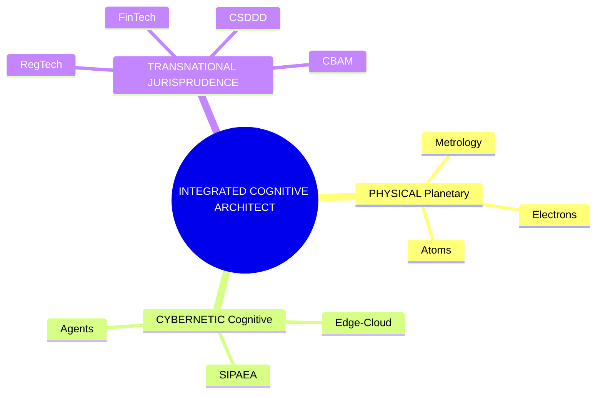

# Skills.md: Socio-Technical Capabilities & Manufacturing Services Engine

## 1. Core Competency Taxonomy (The Atoms-to-Law Spectrum)

To execute the SCVCS infrastructure effectively, personnel and operational units must possess multi-disciplinary capabilities spanning three distinct domains of knowledge.

### A. Material Depth & Metrology Science (Physical Layer)
* **Virtual Metrology (VM) Engineering:** Ability to design and maintain deep learning and novelty detection models that infer physical layer deviations and product quality parameters directly from sensor streams without destructive physical inspections.
* **Angstrom-Scale Analytical Systems:** Skills in operating and integrating high-speed Atomic Force Microscopy (AFM) and inline statistical process control (SPC) data loops into automated telemetry streams.
* **Industrial Metabolic Tracking:** Capacity to accurately audit facility-level resource connectivity—specifically the intersection between cooling water reclamation networks, thermal dissipation, and power configurations.

### B. Cognitive Continuum Engineering (Cybernetic Layer)
* **SIPAEA Framework Orchestration:** Skill in configuring cybernetic feedback systems that utilize both negative (stabilizing) and positive (amplifying) control loops across edge-cloud nodes to ensure real-time facility homeostasis.
* **IDS Connector & TEE Engineering:** Expertise in implementing International Data Spaces (IDS) protocol connectors alongside Trusted Execution Environments (TEEs) at the server level to construct sovereign data boundaries.
* **Agentic Workflow Programming:** Architecture skills for creating autonomous "Professional Proxies" that encapsulate specialized operational logic (Environmental, Privacy, and Auditing roles) via Policy-as-Code engines.

### C. Regulatory & Financial Economics (Jurisprudential Layer)
* **RegTech Compliance Translation:** Technical ability to convert legal provisions (e.g., EU REACH, CSDDD, GDPR Article 25) directly into active machine-executable code parameters and programmatic thresholds.
* **Regenerative Accounting Methodology:** Skills in executing carbon border adjustment accounting and measuring Scope 3 emission trajectories in strict compliance with ITU-T L.1470/L.1480 and SBTi targets.
* **Tokenomics Lifecycle Design:** Mastery over the economic tracking mechanisms governing data-backed Digital Product Passports (DPP) to turn supply chain liabilities into auditable and fundable digital assets.

---

## 2. RegTech & FinTech Manufacturing Services Covered

The SCVCS framework consolidates these competencies into five automated, scalable software-as-a-service (SaaS) and platform-as-a-service (PaaS) infrastructure models deployed directly within the global semiconductor supply chain:

### Service 1: Automated Environmental Stewardship Engine (SSbD-REACH PaaS)
* **Innovation:** Operates on-the-fly chemical and material toxicity checking via Digital Product Passports linked directly to raw inventory and manufacturing dispatch systems.
* **Operationalized Function:** When a factory updates process chemicals for sub-2nm wafer lots, the Professional Proxy autonomously performs a virtual chemical assessment, verifying REACH compliance and substitution alternatives without pausing high-velocity scheduling pipelines.

### Service 2: Sovereign Cross-Border Privacy Escrow (GDPR-IoT SaaS)
* **Innovation:** Hardware-enforced cryptographic boundaries processing high-granularity worker and tool productivity data across multiple geopolitical zones.
* **Operationalized Function:** Brokers data flows within the sensitive Penang-Hsinchu-EU corridor, ensuring that telemetry mapping operator metrics or equipment handling logs is decoupled from identifiable indicators at the edge, maintaining compliance with GDPR Article 25 while enabling joint yield updates.

### Service 3: Real-Time CBAM Embedded Carbon Auditor (Carbon-Trace API)
* **Innovation:** Direct coupling of Cognitive Soft-Sensing water/energy trackers with dynamic reporting ledgers to calculate precise Product Carbon Footprints (PCF).
* **Operationalized Function:** Generates immutable, certified greenhouse gas ledger items mapped to specific semiconductor batches, satisfying EU Carbon Border Adjustment Mechanism criteria automatically without exposing proprietary factory-floor configurations or yield data.

### Service 4: Dynamic Yield-Sustainability Edge Balancer (SIPAEA Core Service)
* **Innovation:** Multi-loop cybernetic infrastructure that elevates edge continuums into reflective governance platforms.
* **Operationalized Function:** Intercepts traditional factory scheduling systems to adjust performance density during instances of localized ecosystem stress (such as municipal droughts or power grid fluctuations), balancing economic yield with regional sustainability set-points.

### Service 5: Regenerative Asset Tokenization Engine (DPP-BOM Ledger)
* **Innovation:** Translating the physical journey of "Atoms-to-Values" into fundable digital bills of materials.
* **Operationalized Function:** Packages end-of-life parameters, manufacturing metadata, and Scope 3 circularity indicators into a compliant Digital Product Passport, allowing downstream electronics integrators to offset circular liabilities and obtain green finance instruments based on verifiable hardware metadata.
